# 命令行编译C#图形界面

> sugar10w, 2016.7.10
>  适用于：第一台笔记本第一次成功安装VS的同学

开始之前，你需要：

- 安装VS
- 了解以下DOS命令的含义：`cd` `dir` `D:`

> C#不是C++++，使用C/C++编写的程序在不能在C#下编译，数组、指针的语法尤其不同。 C#读作C sharp，代表音符C的高半度，是一种同Java相似的面向对象语言。C++小学期的大作业可以用C#完成。

## 新建项目

你已经安装好了VS。现在，尝试新建一个C#项目——

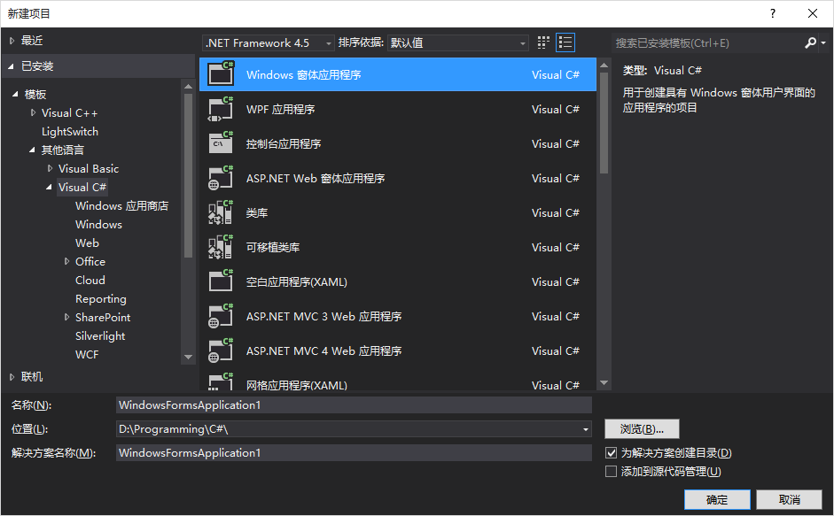

你可以毫不费力地制作一个好看的窗口。

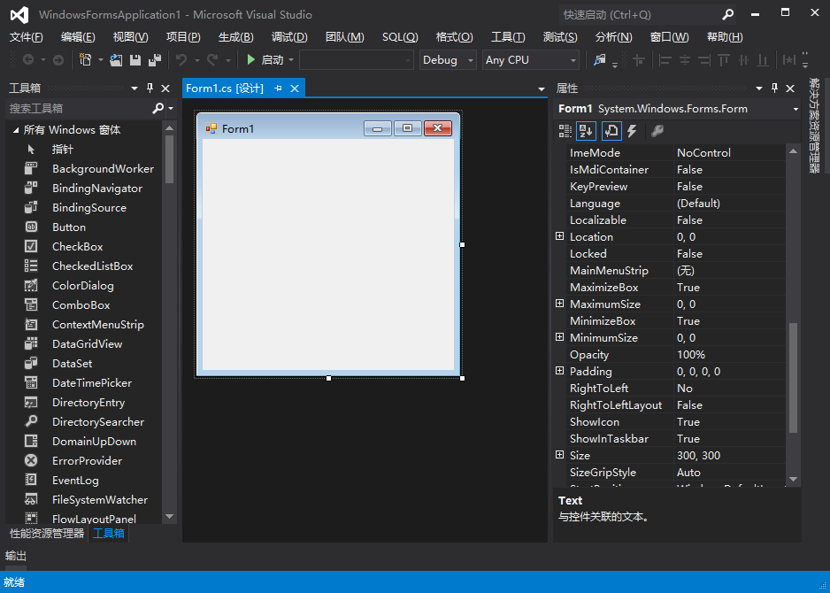

现在点击“启动”，你的窗口就可以运行了。是不是简单粗暴？

就这样，你*不碰键盘*就可以做出一个图形界面—— 但你并不了解VS到底帮你做了什么，对么？

为了保持自己的高逼格，我建议你短暂的离开VS这个强大的IDE，从命令行开始。

## Hello World

第一个程序当然是 Hello World! 
新建一个 test.cs 文件：

<pre><code>using System;
public class TestProgram{
    static void Main(){
        Console.WriteLine("Hello World!");
    }
}
</code></pre>

`using`命令类似于C/C++中的`#include`。 `static void Main()`是整个程序最先运行的函数。

在你的开始菜单中找到“VS2012 开发人员命令提示”，英文名是“Developer Command Prompt for VS2012”，打开。

先使用`D:`之类的命令切换到正确的盘符，然后用`cd`移动到你的工作目录，这里可以在窗口内右击可以找到“粘贴”，直接粘贴路径名就好了。用`dir`确认一下目录里的内容。

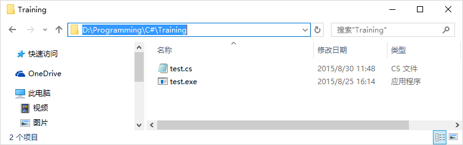

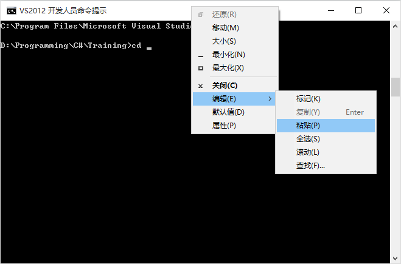

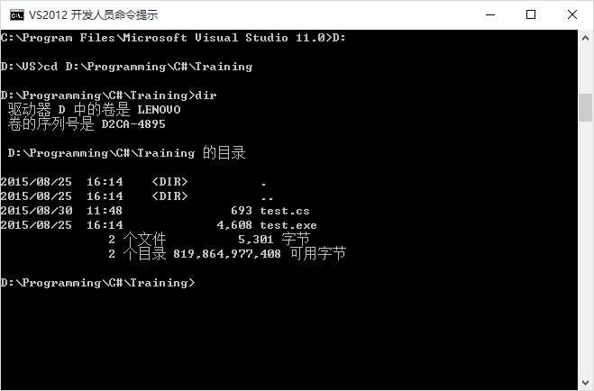

准备就绪了！

使用 `csc` 命令编译 *.cs 文件，即 `csc test.cs`。一般情况下按Tab键可以自动补全文件名。

> 也可以在这里用 cl 命令编译 C/C++ 文件~

所有报错信息都会直接显示在屏幕上，没有报错信息的话就是成功了；用`dir`检查一下test.exe是不是已经出现了。

好的，直接键入`test.exe`运行之。Hello World! 出现了！

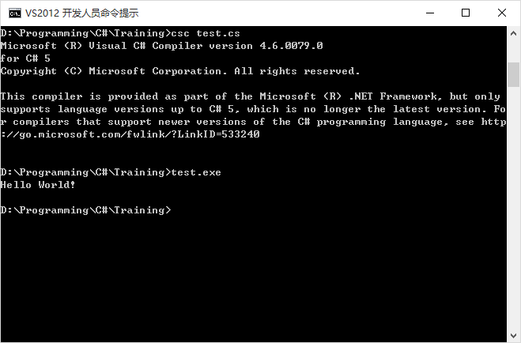

## 我的图形化界面呢

直接调用图形库来展示一个窗口吧！

<pre><code>using System;
using System.Windows.Forms;
public class TestProgram{
     static void Main(){
          Form simpleForm=new Form();
          simpleForm.Height=400;
          simpleForm.Width=400;
          simpleForm.Text="Hello World!";
          Application.Run(simpleForm);
     }
}</code></pre>
编译方法和上面一样。你要的图形化界面出现了！

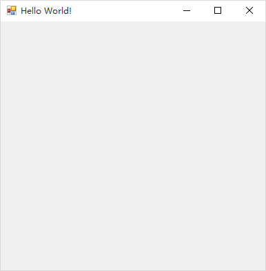

## 怎么把东西放进窗口

继续！在VS的设计器中，可以用鼠标拖进去一个控件（Control），我们在这里用键盘也能加入一个控件（Control）~~

<pre><code>using System;
using System.Windows.Forms;
public class TestProgram{
     static void Main(){
          Form simpleForm=new Form();
          Label simpleLabel=new Label();

          simpleForm.Height=400;
          simpleForm.Width=400;
          simpleForm.Text="Hello World!";

          simpleLabel.Left=100;
          simpleLabel.Top=100;
          simpleLabel.Text="Hello World!";
          simpleForm.Controls.Add(simpleLabel);

          Application.Run(simpleForm);
     }
}</code></pre>
窗口中出现了控件~~~

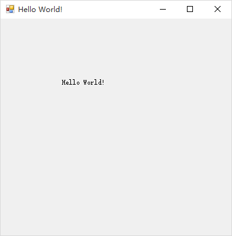

## 用户交互呢？

然后一个关键点就是事件Event处理了！C#的控件可以到检测用户各种各样的操作，进而触发事件Event，而你要做的就是把你的代码塞到合适的Event那里！

<pre><code>using System;
using System.Windows.Forms;
public class TestProgram{
     static void Main(){
        Form simpleForm=new Form();
        Label simpleLabel=new Label();

        simpleForm.Height=400;
        simpleForm.Width=400;
        simpleForm.Text="Hello World!";
        
        simpleLabel.Left=100;
        simpleLabel.Top=100;
        simpleLabel.Text="Hello World!";
        simpleLabel.MouseDown+=label_MouseDown;
        
        simpleForm.Controls.Add(simpleLabel);

        Application.Run(simpleForm);
    }

    static void label_MouseDown(object sender, EventArgs e)
    {
        MessageBox.Show("You Clicked on me !!");    
    }
}</code></pre>

现在，点击Label文本的一瞬间，就会跳出一个小对话框~~

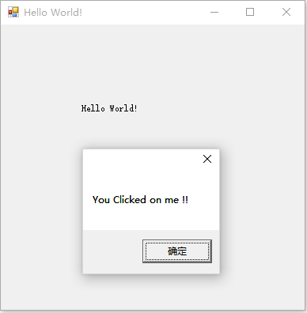

## 我懂了，编程是不需要鼠标的

<pre><code>using System;
using System.Windows.Forms;
using System.Drawing;
public class TestProgram{
    static void Main(){
        Form simpleForm=new Form();
        Label simpleLabel=new Label();
        
        simpleForm.Height=400;
        simpleForm.Width=400;
        simpleForm.Text="Hello World!";
        
        simpleLabel.Left=100;
        simpleLabel.Top=100;
        simpleLabel.Text="Hello World!";
        simpleLabel.Font=new Font("微软雅黑",20);
        simpleLabel.AutoSize=true;
        simpleLabel.MouseDown+=label_MouseDown;
        
        simpleForm.Controls.Add(simpleLabel);

        Application.Run(simpleForm);
    }

    static void label_MouseDown(object sender, EventArgs e)
    {
        MessageBox.Show("You Clicked on me !!");    
    }
}</code></pre>

顺便使用 System.Drawing.Font 为 simpleLabel 换了一个字体~~

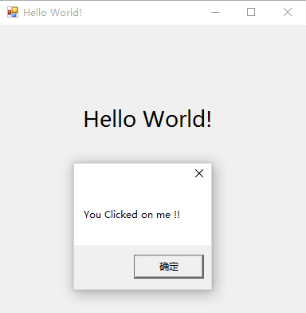

## 回到VS

C#有强大的图形库，写一个图形界面简单明了。当然，这一切功能都是用代码实现的—— 使用VS设计器对`Form1`进行操作时，操作全都会记录在 Form1.designer.cs 文件里（ 在“Windows 窗体设计器生成的代码”里面）。

只有了解VS设计器到底做了些啥，才有使用VS设计器的资格哦~~~

见下图，这个空间的`Click`事件上绑定了函数`label1_Click`

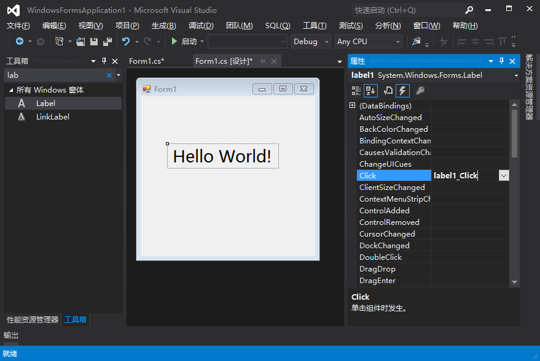
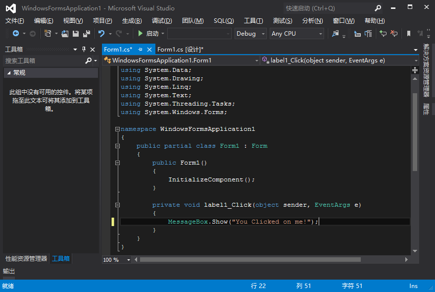

为什么不看看在哪里关联的呢？进入Form1.designer.cs

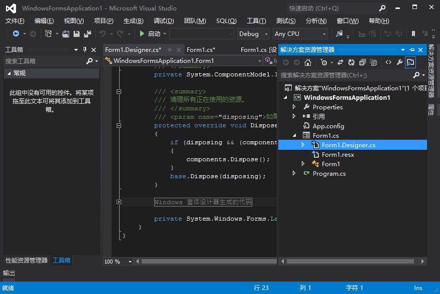

对，就在“不要修改”的下面

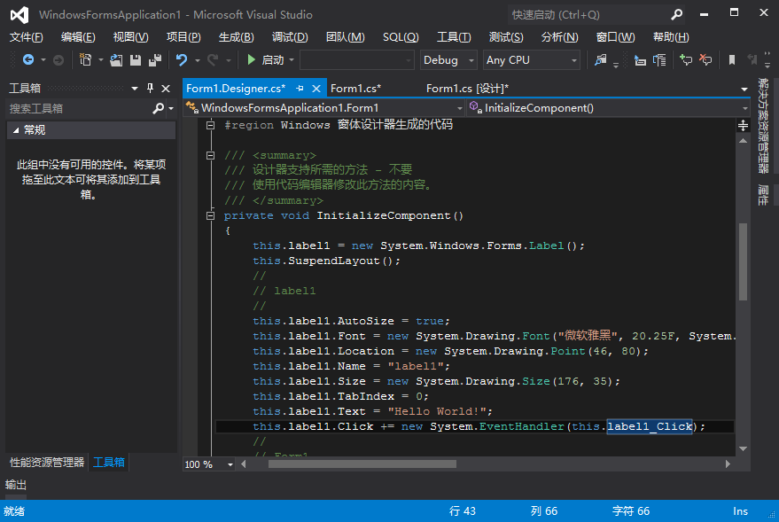

## Next

完成这个任务后（并学完C语言之后），你可以继续学习：

- 面向对象
 
C#是一个彻底的面向对象语言，在其中 int 也是一种对象类型。学习面向对象要掌握类class之间的关系。一定要掌握的内容有：继承，多态。

- 多文件编译

C语言作业80行以下，C语言考试也绝不超过200行。但写一个稍微复杂一点的程序，代码量就会轻松突破1000行；再到后来你就只能用 KB 来描述你的代码量了。如果不按照代码的功能将代码分开放在很多个文件里的话，你会非常头疼的。

你需要学习一下多文件编写基本规范，例如h文件和cpp文件规范。当然，IDE会帮你解决许多问题；总之，当你离开了IDE，希望你不会寸步难行~

## Tips

- `static int Main()` ，其中`Main`的首字母必须大写。
- `Console.Write`以及`Console.WriteLine`通常只在命令行下有效，但在复杂程序的调试时也很有用。类似的还有`Debug.WriteLine`等等。
- 编译提示找不到函数的时候，注意看一下`using`是不是漏了。
